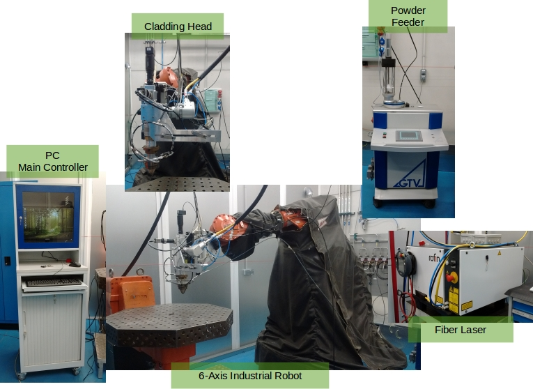

# AIMEN

This package contains modules required to operate AIMEN's LMD robotized laser cell.

*AIMEN's Laser Metal Depositon robotized cell.*

- aimen_abb: contains the 3D files and the kinematics description of the robot.
- aimen_driver: contains the RAPID driver and the required ROS nodes to command
the robot.
- aimen_workcell: contains the workcell description files.

## JASON commands

[JASON commands list](../proper/proper_jason/README.md)
